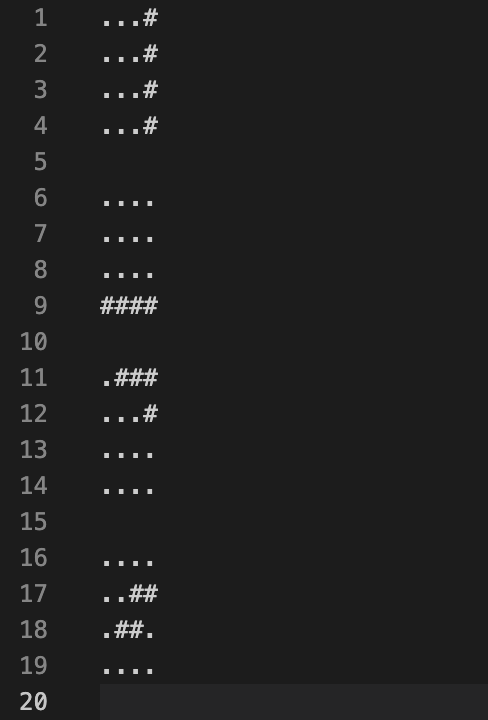
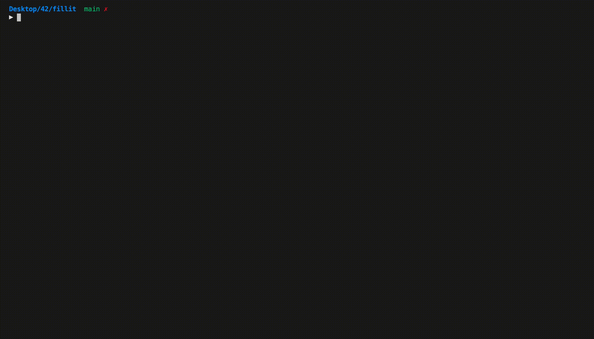

# fillit
This is a 1337 school project, all functions except malloc/free/read/write are prohibited by the school and flagged as a cheat,this project is about stacking a list of given tetris in the smalest square possible

## about the project

this project is about stacking a list of given tetris in a file by this form

then using a backtracking algorythm stack them in the smalest square possible

